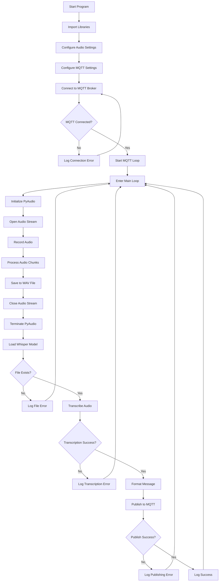

# Speech-To-Text Whisper #

## Spis treści ##
* [Opis](#Opis)
* [Wymagania](#Wymagania)
  * [Biblioteki](#Biblioteki)
* [Instrukcja](#Instrukcja)
* [Diagram przepływu](#diagram-przepływu)

## Opis ##
Program który pobierając dane z mikrofonu komputera - przetwarza je oraz wyrzuca w formie pliku output.wav. Po operacji przechtywywania dźwięku program za pomocą modelu Whisper przetwarza dane z pliku dźwiękowego na format tekstu. 
Program:
* Łaczy się z brokerem MQTT
* Uruchamia na 5 sekund mikrofon komputera z którego zbiera on dźwięki
* Po zakończeniu nagrywania zapisuje plik nagrania w pliku output.wav
* Procesuje plik nagrania za pomocą modelu whisper i wysyła plik przy uzcyiu MQTT
* Proces ten jest powtarzany do momentu przerwania

## Wymagania ##
Do uruchomienia tego skryptu potrzebujemy pythona w wersji > 3.11. Preferowane jest również utworzenie środowiska virtualnego w celu uniknięcia problemów z kompatybilnością bibliotek na komputerze hosta. 
Warto wykorzystywać dokłądniejsze wersje modelu whisper dla osiągnięcia lepszych rezultatów z odczytywanego nagrania. Przykładowo wersja base - najprostsza jest najlżesza, lecz jest też najbardziej ograniczona i ma problemy z rozpoznawaniem wielu słów wypowiadanych przez użytkownika. Bazowo w skrypcie korzystalismy zatem z wersji medium która stanowi kompromis pomiędzy modelami bardzo obciązającymi system a modelami prostymi które nie rozpoznają słów. Wymagany jest również mikrofon do nagrywania dźwięku.

Wersje modelu można zmienić w zmiennej: `model = whisper.load_model("<Wersja>")` w linijce 40

### Biblioteki ### 
* pyaudio
* wave
* whisper
* paho-mqtt

## Instrukcja ##
Aby uruchomić program w środowisku wirtuanym należy:
  1.  Stworzyć nowe środowisko wirtualne za pomoca komendy `python -m venv <nazwa_srodowiska>`
  2.  aktywować środowisko wirtualne za pomocą (dla Windows): `<nazwa_srodowiska>\Scripts\activate`
  3.  Zainstalować zależności programu tj.: `pip install openai-whisper pyaudio torchaudio portaudio19-dev python3-pyaudio paho-mqtt`
  4.  Uruchomić program za pomocą `python speech-to-text.py`. Terminal musi być w katalogu środowiska wirtualnego

## Diagram przepływu

Diagram przedstawia szczegółowy przepływ logiczny kodu oraz interakcje pomiędzy modułami:

