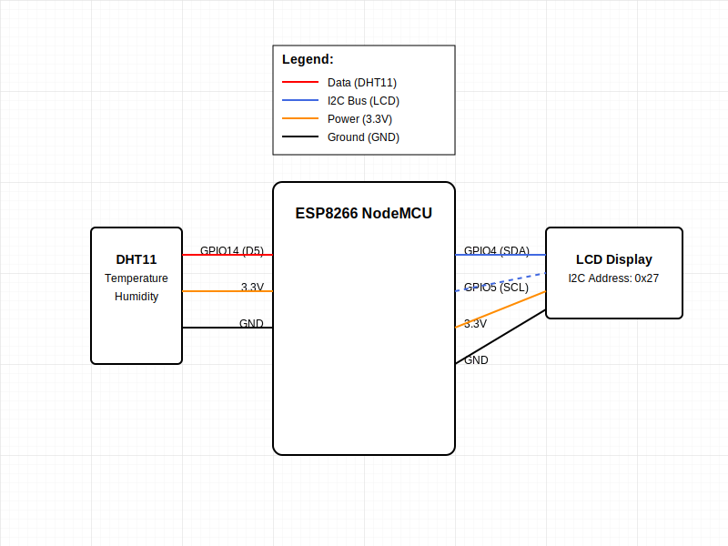
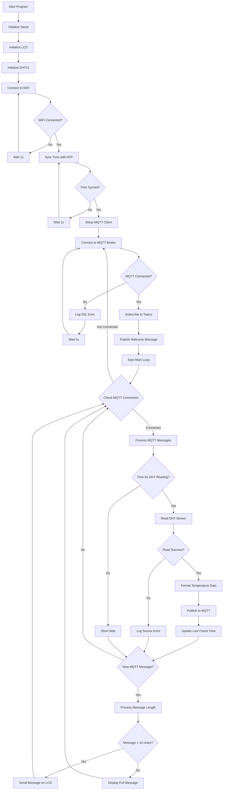

# ESP8266 - Moduł komunikacyjny MQTT

## Spis treści
- [Opis](#opis)
- [Wymagania](#wymagania)
  - [Sprzęt](#sprzęt)
  - [Biblioteki](#biblioteki)
- [Schemat połączeń](#schemat-połączeń)
- [Diagram przepływu](#diagram-przepływu)
- [Konfiguracja](#konfiguracja)
  - [Parametry WiFi](#parametry-wifi)
  - [Parametry MQTT](#parametry-mqtt)
- [Użycie](#użycie)
- [Struktura kodu](#struktura-kodu)
- [Rozwiązywanie problemów](#rozwiązywanie-problemów)

## Opis
Moduł ESP8266 służy jako urządzenie IoT, które:
- Odczytuje dane z czujnika temperatury DHT11
- Wyświetla informacje na wyświetlaczu LCD I2C
- Komunikuje się poprzez protokół MQTT z brokerem
- Obsługuje bezpieczną komunikację poprzez SSL/TLS

## Wymagania
### Sprzęt
- ESP8266 (NodeMCU lub podobny)
- Czujnik DHT11
- Wyświetlacz LCD I2C (16x2)
- Przewody połączeniowe

### Biblioteki
Poniżej znajdują się wymagane biblioteki oraz instrukcje ich instalacji.

1. **ESP8266WiFi**:
   - Wbudowana w pakiet ESP8266 Arduino Core.
   - Jeśli nie masz pakietu ESP8266, [dodaj go do Arduino IDE](https://arduino.esp8266.com/stable/package_esp8266com_index.json):
     1. Otwórz **File > Preferences**.
     2. W polu **Additional Board Manager URLs** dodaj powyższy link.
     3. Otwórz **Tools > Board > Board Manager**, wyszukaj `ESP8266` i zainstaluj.

2. **PubSubClient**:
   - Obsługa MQTT.
   - Instalacja:
     1. Otwórz **Tools > Manage Libraries**.
     2. Wyszukaj `PubSubClient` i kliknij **Install**.

3. **Adafruit_Sensor**:
   - Wspierana przez czujniki Adafruit, np. DHT11.
   - Instalacja:
     1. Otwórz **Tools > Manage Libraries**.
     2. Wyszukaj `Adafruit Unified Sensor` i kliknij **Install**.

4. **DHT**:
   - Biblioteka do obsługi czujnika DHT11.
   - Instalacja:
     1. Otwórz **Tools > Manage Libraries**.
     2. Wyszukaj `DHT sensor library` i kliknij **Install**.

5. **LiquidCrystal_I2C**:
   - Do obsługi wyświetlacza LCD z interfejsem I2C.
   - Instalacja:
     1. Otwórz **Tools > Manage Libraries**.
     2. Wyszukaj `LiquidCrystal_I2C` i kliknij **Install**.

## Schemat połączeń
Poniżej znajduje się schemat połączeń modułu ESP8266 z czujnikiem DHT11 oraz wyświetlaczem LCD:


- DHT11:
  - PIN danych: GPIO14 (D5)
  - VCC: 3.3V
  - GND: GND
- LCD I2C:
  - SDA: GPIO4 (D2)
  - SCL: GPIO5 (D1)
  - VCC: 3.3V
  - GND: GND

## Diagram przepływu

Diagram przedstawia szczegółowy przepływ logiczny kodu oraz interakcje pomiędzy modułami:



## Konfiguracja
### Parametry WiFi
```cpp
const char *ssid = "TWÓJ_SSID";
const char *password = "TWOJE_HASŁO";
```

### Parametry MQTT
```cpp
const int mqtt_port = 8883;
const char *mqtt_broker = "n9ee4478.ala.eu-central-1.emqxsl.com";
const char *mqtt_speech_to_text_topic = "speech_to_text";
const char *mqtt_video_to_text_topic = "video_to_text";
const char *mqtt_temperature_topic = "temperature";
const char *mqtt_username = "esp8266";
const char *mqtt_password = "public";
```

## Użycie
Po uruchomieniu, urządzenie:
1. Łączy się z siecią WiFi
2. Synchronizuje czas z serwerem NTP
3. Nawiązuje połączenie z brokerem MQTT
4. Rozpoczyna:
   - Odczyt temperatury
   - Nasłuchiwanie wiadomości MQTT
   - Wyświetlanie informacji na LCD

## Struktura kodu
Główne funkcje:
```cpp
void connectToWiFi()      // Połączenie z WiFi
void syncTime()           // Synchronizacja czasu
void measure()            // Pomiar temperatury
void connectToMQTT()      // Połączenie z brokerem MQTT
void mqttCallback()       // Obsługa przychodzących wiadomości
```

## Rozwiązywanie problemów
1. Problem z połączeniem WiFi:
   - Sprawdź poprawność SSID i hasła
   - Upewnij się, że sieć jest w zasięgu

2. Problem z MQTT:
   - Sprawdź poprawność certyfikatu SSL
   - Zweryfikuj dane dostępowe do brokera
   - Sprawdź logi Serial Monitor

3. Problem z czujnikiem DHT11:
   - Sprawdź połączenia
   - Zweryfikuj numer pinu w kodzie
   - Upewnij się, że biblioteka jest poprawnie zainstalowana

4. Problem z wyświetlaczem LCD:
   - Sprawdź adres I2C (domyślnie 0x27)
   - Zweryfikuj połączenia SDA i SCL
