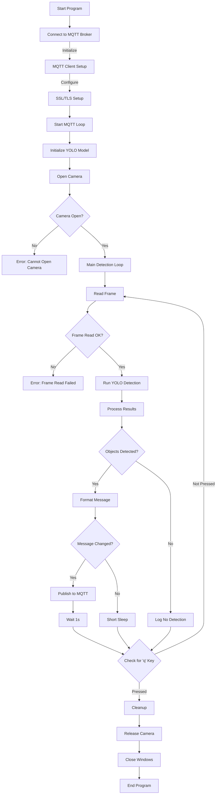

# Object Detection with YOLOv8 and MQTT #

## Spis treści ##
* [Opis](#Opis)
* [Wymagania](#Wymagania)
  * [Biblioteki](#Biblioteki)
* [Instrukcja](#Instrukcja)
* [Diagram przepływu](#diagram-przepływu)

## Opis ##
Program wykorzystujący model YOLOv8 do wykrywania obiektów za pomocą kamery internetowej. Wyniki detekcji są przesyłane do brokera MQTT, co umożliwia ich dalsze przetwarzanie lub wykorzystanie w innych aplikacjach. Program działa w czasie rzeczywistym, a wykryte obiekty są również wizualizowane na obrazie z kamery.

Program:
* Łączy się z brokerem MQTT, przesyłając dane o wykrytych obiektach.
* Wykorzystuje model YOLOv8 do analizy obrazu z kamery internetowej.
* Wyświetla obraz z zaznaczonymi wykrytymi obiektami w czasie rzeczywistym.
* Wysyła listę wykrytych obiektów jako wiadomość MQTT.
* Działa w pętli do momentu ręcznego zakończenia (klawisz `q`).

## Wymagania ##
Do uruchomienia tego skryptu potrzebny jest Python w wersji > 3.8. Zalecane jest stworzenie środowiska wirtualnego, aby uniknąć konfliktów pomiędzy bibliotekami. Program wymaga również pliku certyfikatu `emqxsl-ca.crt`, który należy umieścić w katalogu, z którego uruchamiany jest skrypt. Ważna jest również kamera do wykrywania obiektów.

### Biblioteki ### 
* `ultralytics` - do obsługi modelu YOLOv8.
* `opencv-python` - do przetwarzania obrazu.
* `paho-mqtt` - do komunikacji z brokerem MQTT.

## Instrukcja ##
Aby uruchomić program w środowisku wirtuanym należy:
  1.  Stworzyć nowe środowisko wirtualne za pomoca komendy `python -m venv <nazwa_srodowiska>`
  2.  aktywować środowisko wirtualne za pomocą (dla Windows): `<nazwa_srodowiska>\Scripts\activate`
  3.  Zainstalować zależności programu tj.: `pip install ultralytics opencv-python paho-mqtt`
  4.  Uruchomić program za pomocą `python video-to-text.py`. Terminal musi być w katalogu środowiska wirtualnego

  
## Dodatkowe informacje ##
1. Upewnij się, że posiadasz plik certyfikatu `emqxsl-ca.crt` wymagany do bezpiecznego połączenia z brokerem MQTT.
2. W razie problemów z kamerą sprawdź jej działanie w innych aplikacjach lub upewnij się, że sterowniki są poprawnie zainstalowane.
3. Model YOLOv8 można zmienić, modyfikując nazwę pliku w funkcji `YOLO("yolov8n.pt")` na inny dostępny model, np. `yolov8m.pt` (bardziej dokładny, ale wolniejszy) lub `yolov8s.pt` (kompromis pomiędzy szybkością a dokładnością).

## Diagram przepływu

Diagram przedstawia szczegółowy przepływ logiczny kodu oraz interakcje pomiędzy modułami:

